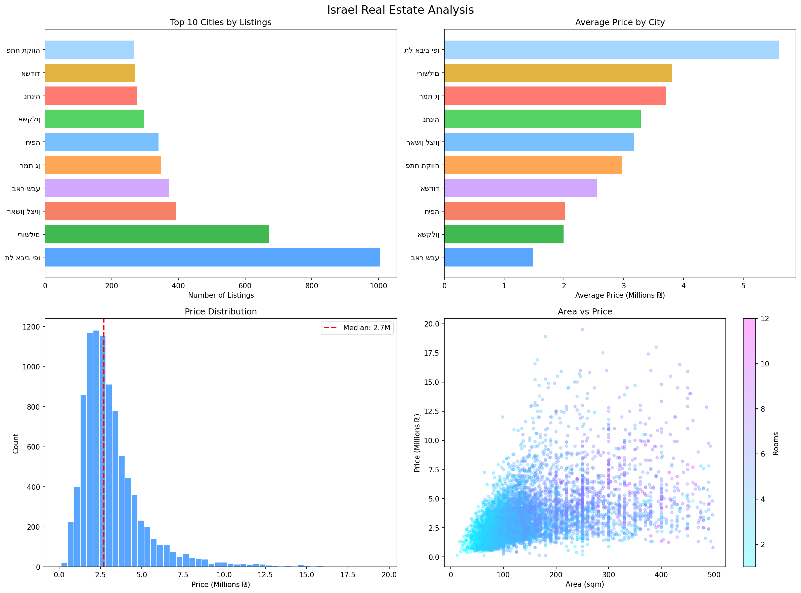

# 🏠 Israel Real Estate Analysis

A data analysis project exploring property prices across Israeli cities using real listings from Yad2.

---

## 📌 Project Question
**How much do property prices vary between Israeli cities?**

---

## 🔍 Key Findings
- **Tel Aviv** has the most listings by far (1,000+ properties)
- The price gap between the cheapest and most expensive cities is **over 3x**
- The median property price in Israel is **~2.7 Million ₪**
- There is a clear correlation between property size (sqm) and price
- More rooms = higher price, but location matters more than size

---

## 📊 Visualizations


- **Top 10 Cities by Listings** — Which cities have the most properties for sale
- **Average Price by City** — Price comparison across major cities
- **Price Distribution** — How prices are spread across all listings
- **Area vs Price** — Relationship between property size and price (colored by number of rooms)

---

## 🛠️ Tools Used
- **Python 3**
- **Pandas** — Data loading and cleaning
- **Matplotlib** — Visualizations

---

## 📁 Dataset
- Source: [Yad2](https://www.yad2.co.il) (Israel's largest real estate platform)
- ~9,900 property listings
- Features: price, city, neighborhood, floor, rooms, area (sqm)

---

## 🚀 How to Run

1. Clone the repository:
```
git clone https://github.com/YOUR_USERNAME/israel-real-estate-analysis
```

2. Install requirements:
```
pip install pandas matplotlib
```

3. Run the analysis:
```
python analysis.py
```

---

## 👤 About
Made by **Naseem Zbedat** — First-year Data Science student at Tel Aviv University.

